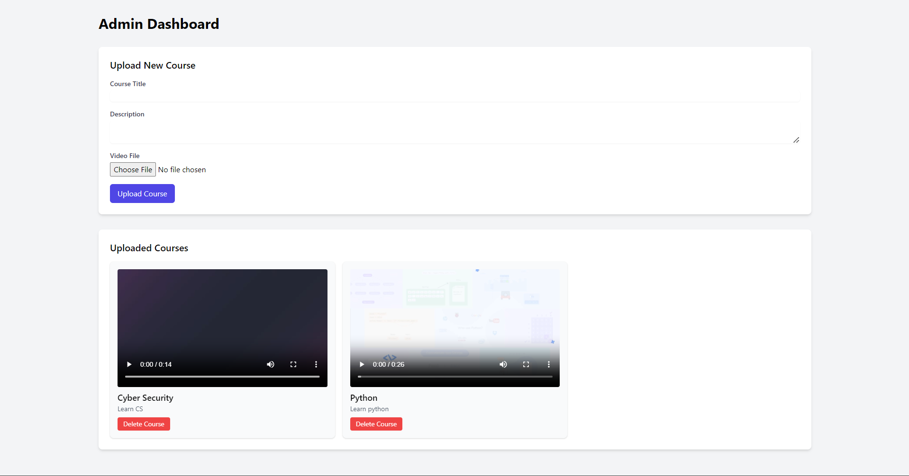
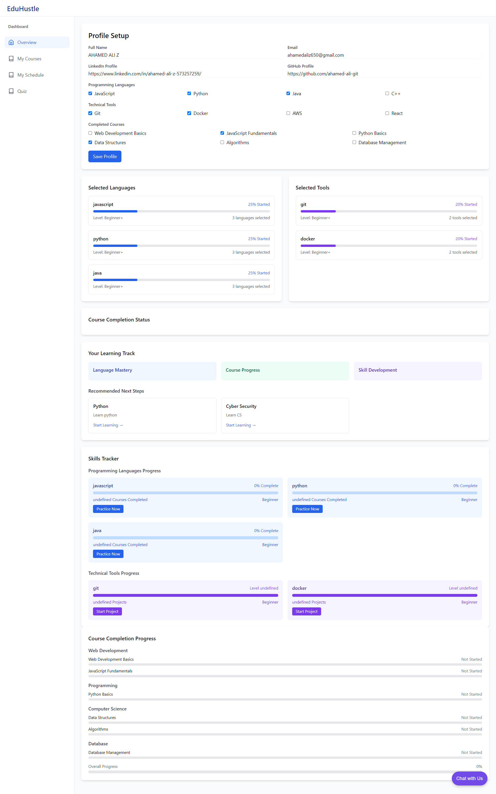

# EduHustle - Learning Platform 

EduHustle is a comprehensive web-based learning management system designed to facilitate online education through video courses, scheduling, and content management. The platform provides interfaces for both educators and students.

## Features

### For Educators
- **Course Management**
  - Upload and manage course videos
  - Create and organize course content
  - Track student progress
  - Manage course schedules

### For Students
- **Course Access**
  - Browse available courses
  - Watch video lectures
  - Filter courses by category
  - Track learning progress

### Administrative Features
- **Video Management**
  - Upload and store educational videos
  - Organize content by categories
  - Delete and modify existing content
  - Stream video content

### Class Scheduling
- **Schedule Management**
  - Create and manage class schedules
  - Set class timings and locations
  - Track daily/weekly schedules
  - Manage multiple courses


## Screenshots

### Home Page


### Admin Dashboard


### Student Profile


## Technical Stack

### Frontend
- HTML5/EJS Templates
- Tailwind CSS (v2.2.19)
- JavaScript (ES6+)
- Feather Icons

### External Dependencies
- Tailwind CSS CDN
- Feather Icons Library


## Setup and Installation

1. Install dependencies:
```bash
npm install
```

2. Configure environment variables:
```bash
# Create .env file
touch .env
```

3. Start the application:
```bash
nodemon
```

### Admin Dashboard
- Video upload interface
- Course management
- Content organization

### Course Catalog
- Course browsing interface
- Search functionality
- Category filtering
- Course details view

### Schedule Management
- Class scheduling interface
- Timeline view
- Schedule modification tools

## Security Features

- Secure video streaming
- User authentication (to be implemented)
- Role-based access control
- Input validation

## Browser Support

- Chrome (latest)
- Firefox (latest)
- Safari (latest)
- Edge (latest)

## Contributing

1. Fork the repository
2. Create your feature branch (`git checkout -b feature/YourFeature`)
3. Commit your changes (`git commit -m 'Add YourFeature'`)
4. Push to the branch (`git push origin feature/YourFeature`)
5. Create a Pull Request

## License

This project is licensed under the MIT License - see the LICENSE file for details.

## Future Enhancements

- User authentication system
- Student progress tracking
- Interactive assessments
- Real-time messaging
- Mobile application
- Payment integration
- Analytics dashboard

---
